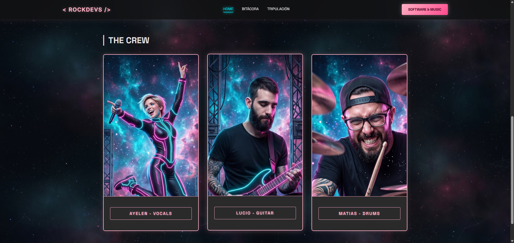
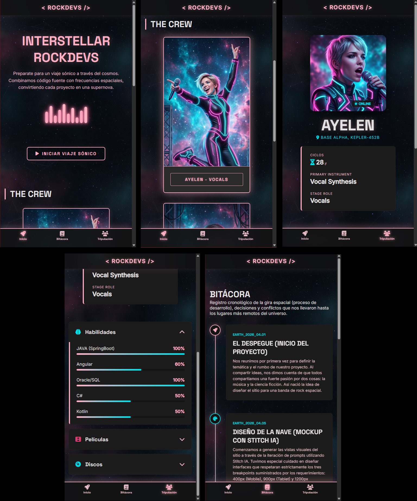
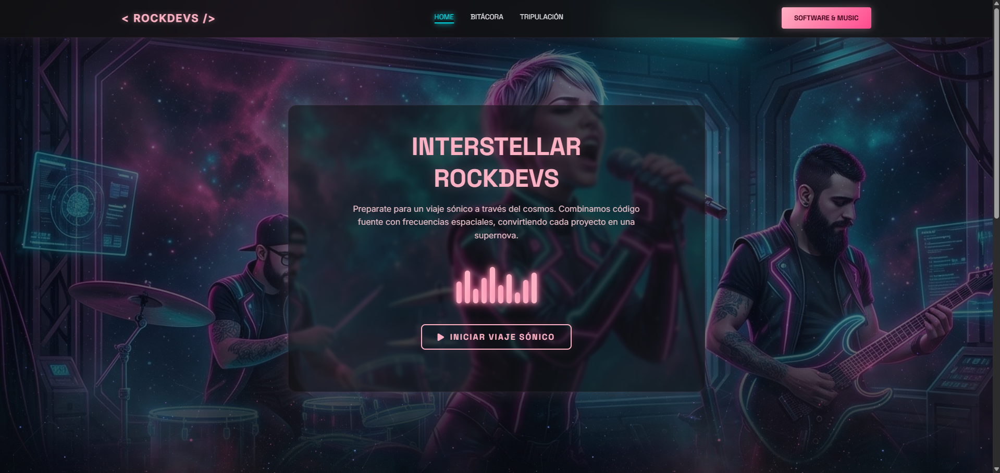
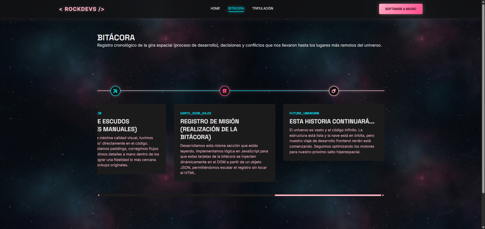
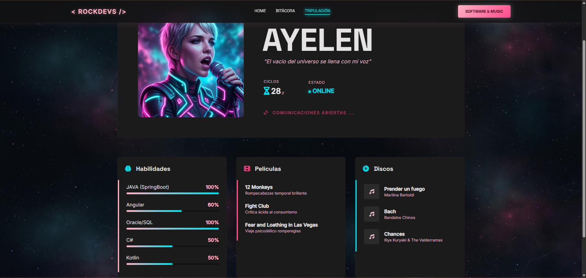
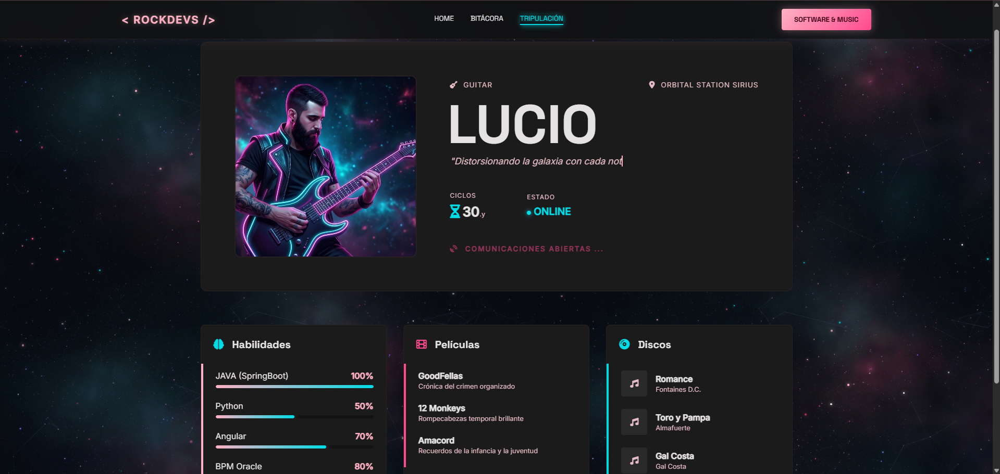
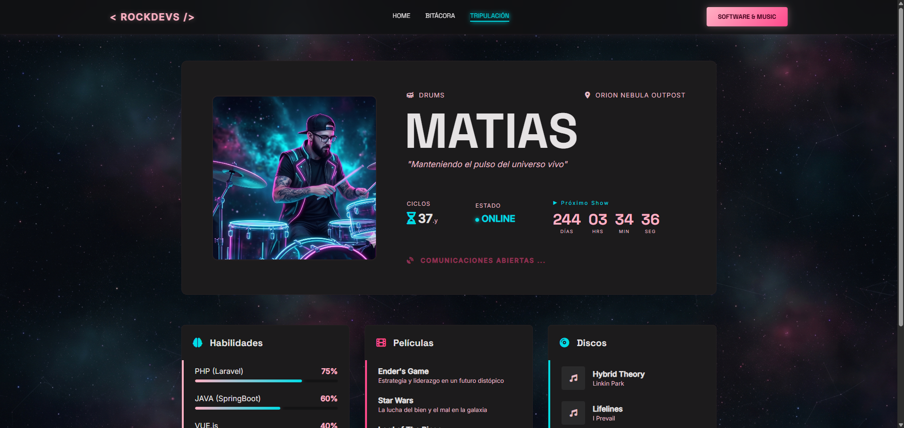

# 🎸 Interstellar RockDevs 🎸

🔗 **[Enlace al Proyecto Desplegado en Vercel](https://interestellar-rockdevs.vercel.app/)**

## Descripción del Proyecto
**Interstellar RockDevs** es una plataforma web con temática "Espacial" diseñada para presentar a una banda de rock conformada por desarrolladores de software. El objetivo del trabajo práctico es aplicar conceptos de maquetación responsive, metodologías CSS (BEM) y renderizado dinámico del DOM junto con Javascript. Las funcionalidades básicas incluyen un reproductor de audio integrado con animaciones CSS sincronizadas, una bitácora de desarrollo generada dinámicamente y perfiles de usuario que cargan información específica desde un objeto JSON simulado a través de parámetros de URL, incluyendo interacciones personalizadas (parallax, typewriters, contadores) para cada integrante.

## Integrantes
* **Ayelen** | [Perfil de GitHub](https://github.com/ayecristi)
* **Lucio** | [Perfil de GitHub](https://github.com/luciograma)
* **Matias** | [Perfil de GitHub](https://github.com/matias-estanqueiro)



## Tecnologías Utilizadas
* **HTML5** (Semántico)
* **CSS3 Vanilla** (Metodología BEM, CSS Grid, Flexbox, Custom Properties/Variables)
* **JavaScript Vanilla** (ES6+, DOM Manipulation, URLSearchParams, IntersectionObserver)

## Estructura de Archivos

```text
Interstellar-RockDevs/
├── audio/
├── css/
├── img/
├── js/
├── mock/
├── readme_img/
├── index.html
├── logbook.html
├── profile.html
└── README.md
```

El proyecto sigue una arquitectura clásica y limpia para frontend estático:
* `/` (Directorio Raíz): Contiene las vistas principales (`index.html`, `logbook.html`, `profile.html`) y este archivo `README.md`.
* `/audio/`: Contiene el archivo mp3 para la experiencia sonora del Hero.
* `/css/`: Contiene `styles.css` con todos los estilos globales, tokens de diseño y media queries del proyecto.
* `/img/`: Almacena todos los recursos gráficos, avatares generados por IA, fondos espaciales y favicon.
* `/js/`: Archivos de lógica funcional separados por vista (`index.js`, `logbook.js`, `profile.js`).

Además cuenta con las siguientes carpetas, las cuales ayudan a no romper la estructura y arquitectura del mismo:
* `/mock/`: Contiene las imagenes de los mocks creados con IA (Google Stitch IA).
* `/readme_img/`: Contiene las imágenes (capturas de pantalla del proyecto) que son utilizadas dentro del archivo readme.MD

## Guía de Estilos

### Paleta de Colores
Utilizamos un esquema de colores de alto contraste, combinando fondos oscuros del espacio profundo con acentos neón estilo Cyberpunk:
* **Fondos y Superficies:**
    * Fondo Principal: `#131314`
    * Superficie Baja (Cards): `#1c1b1c`
    * Superficie Alta (Modales/Headers): `#2a2a2b`
* **Textos:**
    * Texto Principal: `#e5e2e3`
    * Texto Secundario: `#e5bcc5`
* **Acentos Neón:**
    * Rosa Principal (Títulos/Bordes): `#ffb1c4`
    * Rosa Oscuro (Botones/Hover): `#ff4a8d`
    * Cyan Neón (Detalles/Ubicaciones): `#00dce5`

### Tipografías (Google Fonts)
* **Titulares y Botones:** [Space Grotesk](https://fonts.google.com/specimen/Space+Grotesk) (Pesos: 400, 700, 900). Elegida por su estética geométrica y futurista.
* **Cuerpo de Texto:** [Inter](https://fonts.google.com/specimen/Inter) (Pesos: 400, 500). Elegida por su altísima legibilidad en pantallas oscuras.

### Iconografía e Imágenes
* **Iconos:** Utilizamos la librería **FontAwesome (CDN)** para mantener consistencia visual en métricas, redes y navegación.
* **Avatares, fondos e imágenes de la banda (IA):** Todos los avatares e ilustraciones fueron generados mediante Inteligencia Artificial (Nano Banana - Google) manteniendo una dirección de arte coherente con el estilo Espacial.

## CSS: Media Queries y Responsive Design (400px, 900px, 1200px)

El proyecto fue construido bajo un enfoque **Mobile First**, garantizando que la experiencia principal sea fluida en dispositivos móviles, para luego escalar estructuralmente mediante Media Queries en Tablet y Desktop. No nos limitamos a "achicar" o "agrandar" cajas, sino que mutamos el layout de los componentes clave para una mejor UX/UI.

### Dispositivos Móviles (Base y 400px)
El diseño base está optimizado para la lectura vertical y el uso táctil con una sola mano.
* **Navegación:** Se oculta el menú superior tradicional y se implementa una "Bottom Navigation Bar" (`.nav-mobile`) fijada en la parte inferior de la pantalla.
* **Layout:** Las grillas de tripulación y acordeones se apilan en una sola columna (`1fr`).
* **Profile Hero:** La imagen del integrante se posiciona por encima, centrada y en formato cuadrado. Por debajo, aparece la caja de información que contiene acordiones HTML los datos en lista vertical.

<div align="center"></div>

### Tablet (900px)
Al alcanzar los 900px, la interfaz aprovecha el mayor espacio horizontal para mostrar más información simultánea.
* **Navegación:** Desaparece la barra inferior y se activa el menú de navegación en el `<header>` superior (comportamiento tradicional).
* **Grillas y Listas:** La sección de tripulación y los detalles/acordeones pasan a un formato CSS Grid de 3 columnas (`repeat(3, 1fr)`).
* **Index Hero:** La portada adquiere altura completa (`100vh`) e implementa un efecto de *Glassmorphism* (fondo oscuro semitransparente con `backdrop-filter: blur`) sobre una imagen de fondo full-cover.
* **Profile Hero:** Transición drástica de diseño. La imagen se expande ocupando todo el ancho (formato 16:9), y la información del integrante se superpone centrada, transformando los datos en pequeñas "píldoras" oscuras.
* **Bitácora (Timeline):** La línea de tiempo deja de ser un listado vertical simple y pasa a tener los nodos intercalados (izquierda y derecha de la línea central).

<div align="center"></div>

### Desktop (1200px)
El punto de ruptura final establece topes de ancho (`max-width: 1200px`) para mantener la armonía visual en pantallas ultra-anchas.
* **Profile Hero:** Abandona el diseño superpuesto de Tablet para adoptar un formato de "Tarjeta de Presentación" apaisada (`flex-direction: row`). La imagen vuelve a ser cuadrada, encapsulada a la izquierda, y toda la información respira hacia la derecha, con datos reubicados (como la locación posicionada de forma absoluta en la esquina superior derecha).
* **Bitácora (Timeline):** Mutación completa del componente. La línea de tiempo vertical se transforma en un carrusel horizontal interactivo y escroleable en el eje X, mejorando el consumo de grandes bloques de texto en monitores panorámicos.

** *[Las capturas de pantalla relacionadas con esta mediaquery (1200) se pueden visualizar en las siguientes secciones, a fin de no incluir imágenes repetitivas dentro de este archivo]* **

## JavaScript: Funcionalidades Dinámicas

El proyecto cuenta con interactividad avanzada desarrollada enteramente en Vanilla JavaScript.

### 1. Portada (Home) - `js/index.js`
* **Reproductor de Audio y Ecualizador CSS:** Intercepta el evento de clic del botón "Iniciar Viaje Sónico". Al activarse, reproduce el archivo de audio oculto y añade dinámicamente la clase `.animating` a las 10 barras del ecualizador CSS para sincronizar la experiencia visual con la auditiva. Permite pausar y reanudar la experiencia.



### 2. Bitácora Dinámica - `js/logbook.js`
* **Renderizado de Timeline:** Se creó un Array de objetos (`logbookData`) que actúa como base de datos local. El script itera sobre este array utilizando un `forEach` y renderiza el HTML de cada tarjeta (`<article class="timeline__node">`) inyectándolo en el contenedor principal. Esto permite agregar nuevos hitos al proyecto modificando solo el JS.



### 3. Perfiles Dinámicos e Individualizados - `js/profile.js`
* **Carga de Datos vía URL:** La página `profile.html` es una plantilla vacía. El script lee el parámetro `?member=nombre` usando `URLSearchParams`. Busca al miembro en el objeto `crewDatabase` y rellena el DOM (fotos, nombres, textos).
* **Renderizado de Listas:** Las barras de habilidades (con inyección de estilos `width` en línea para los porcentajes) y los acordeones de películas/discos se iteran y renderizan dinámicamente según el integrante elegido.
* **Features Exclusivas por Integrante (`loadFeature`):**
    * **Ayelen:** Activa `featureAnimatedBars`, utilizando la API `IntersectionObserver` para que las barras de progreso se animen desde el 0% hasta su porcentaje real solo cuando el usuario hace scroll y las ve en pantalla.
    * **Lucio:** Activa `featureTypeWriter` (efecto de máquina de escribir recursivo para su frase) y `initParallax` (crea un canvas de estrellas dinámicas generadas por JS que se mueven a distintas velocidades según el scroll).
    * **Matias:** Activa `featureCountdown`, un reloj calculador en tiempo real que hace una cuenta regresiva hacia el "próximo show" basado en fechas ISO.







## 🤖 Uso de Inteligencia Artificial

Durante el ciclo de desarrollo de este TP, la IA fue utilizada como una herramienta de apoyo técnico y generativo:

* **Herramientas Utilizadas:** Stitch IA, Google Gemini IA y Nano Banana.
* **Modelos de IA Utilizados:** Al momento de realizar este Trabajo Práctico, todas las herramientas empleadas se encuentran integradas dentro del ecosistema de Inteligencia Artificial de Google. A continuación se detallan los modelos subyacentes:
  * **Asistencia General y Código:** Se utilizó el modelo más reciente y avanzado disponible para la web, **Gemini 3.1 Pro**.
  * **Generación de Imágenes:** El motor empleado para esta tarea se basa en el modelo **Nano Banana 2** (cuyo nombre técnico oficial es **Gemini 3 Flash Image**).
  * **Generación de Interfaces (Stitch IA):** Esta plataforma experimental está impulsada por la familia de modelos de Google DeepMind. Su arquitectura se apoya principalmente en los modelos **Gemini 3.1 Pro** y **Gemini Flash** para interpretar instrucciones y diseñar pantallas interactivas. Durante su evolución, la herramienta también ha integrado la potencia de **Gemini 2.5 Pro** para decodificar descripciones complejas y estructurar componentes funcionales exportables a HTML/CSS y Figma.
* **Uso en Contenido y Código:** 
    * **Stitch IA:** Utilizado en las fases iniciales para iterar sobre mockups rápidos y maquetas base (que originalmente devolvían código en Tailwind).
    * **Gemini Pro 3.1:** Actuó como asistente de Ingeniería Frontend. Se le solicitó ayuda exhaustiva para refactorizar la maqueta de Tailwind a Vanilla CSS puro utilizando BEM. Además, asistió en la lógica de resolución de conflictos complejos en el CSS (como mantener el Glassmorphism y la posición de la imagen de perfil entre los breakpoints de Mobile y Desktop) y generó la estructura base para los scripts dinámicos de renderizado (JSON a DOM).
    * **Textos:** La redacción de la bitácora y los *quotes* de los integrantes se generaron con asistencia de IA para mantener el tono temático "Espacial/Rock".
    * **Imágenes:** * Los avatares de "Ayelen", "Lucio" y "Matias" fueron creados a partir de *prompts* específicos.
    * **Criterio de Prompt:** Se indicó a la IA generar fotografías hiperrealistas de músicos tocando sus instrumentos (micrófono, guitarra, batería), solicitando específicamente la iluminación de la paleta del proyecto ("iluminación neón cyan y rosa", "fondo de nebulosa espacial oscura", "estilo cyberpunk sobrio").